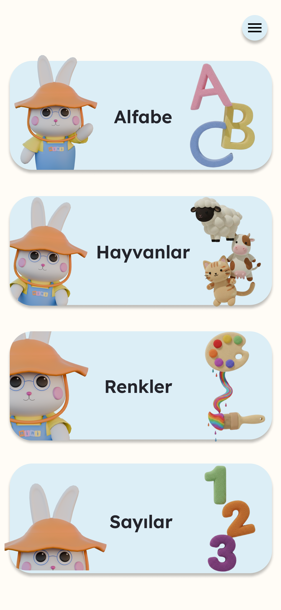
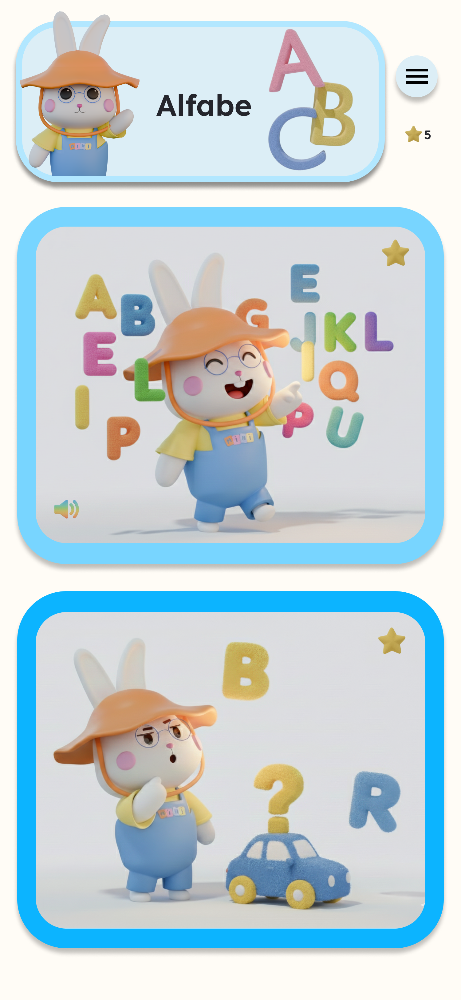
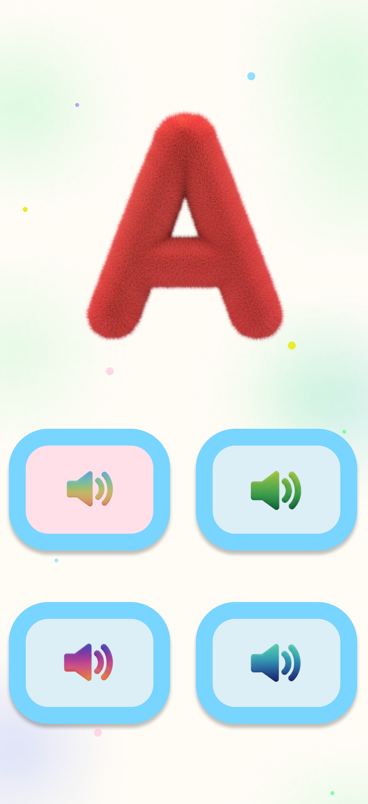
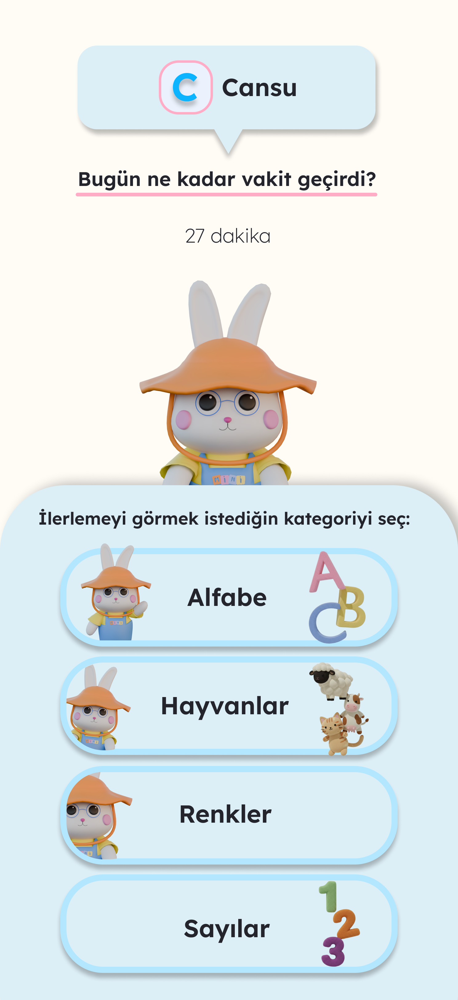

# MiniMind | Preschool Learning Mobile App (Frontend & UI)

An interactive, student-led educational mobile application designed to support early childhood learning through intuitive, engaging, and playful modules.

Developed collaboratively within the **IEEE Student Branch** by a cross-functional student engineering team. This repository showcases the **mobile frontend architecture, interactive UI components, and Figma-to-Flutter design implementations**.

---

## My Contributions

As the frontend and UI developer on the team, my primary focus included:
- **UI/UX Design:** Wireframed, prototyped, and finalized responsive mobile screens and component variants in Figma.
- **3D Mascot Modeling:** Designed and modeled the application's 3D mascot from scratch using **Blender**, creating the character assets and visual identity for the children's learning screens.
- **Flutter Implementation:** Translated design specifications into reusable Flutter widgets, custom navigation flows, and interactive state management.
- **Agile Collaboration:** Participated in sprint planning, feature ideation, and design alignment within the IEEE student development squad.

---

## UI / UX Design & App Previews

> *Parent Onboarding & Account Setup
Initial onboarding sequence designed for parents, including account creation, profile setup, and app orientation with a clean, trustworthy aesthetic.*,

<div align="center">
  
  
  
</div>

<br/>

> Child Learning & Gameplay Experience
Interactive, playful screens tailored specifically for children. Features the custom **Blender-modeled 3D mascot**, vibrant color palettes, big touch targets, and gamified learning cards.,

<div align="center">
  
  
  
</div>

<br/>

> Parent Analytics & Progess Dashboard
A dedicated parent-facing analytics interface providing real-time insights into the child's learning curve, completed modules, time spent, and AI-assisted progress suggestions.,


<div align="center">
  
</div>

> **Note:** Below is a curated preview showcasing key interactive modules. The full design system includes additional gameplay flows, transition states, and extended learning levels.

---

## Features & Learning Modules

- **Colors & Animals:** Visual-audio association cards and identification games.
- **Numbers & Counting:** Step-by-step counting mini-games with dynamic visual feedback.
- **Alphabet & Vocabulary:** Interactive 28-letter phonetics and alphabet tracking components.
- **Parent Analytics Dashboard:** UI prototypes for progress reports and AI-assisted performance insights.
- **Playful UI Feedback:** Custom animations, responsive layouts, and child-safe navigation flows.

---

## Tech Stack & Tools

- **Framework:** [Flutter](https://flutter.dev/) (Mobile Client)
- **Language:** [Dart](https://dart.dev/)
- **UI/UX & Prototyping:** [Figma](https://www.figma.com/)
- **3D Modeling:** [Blender](https://www.blender.org/) (Custom 3D mascot (Mini) & character design)
- **Asset Pipeline:** Custom vector assets, fonts, and modular UI cards.

---


## Security & Architecture Note

This repository contains the **client-side mobile application code and interface assets**. Backend services, private API endpoints, database credentials, and server logic are maintained in private organization repositories to adhere to security best practices.

---

## Getting Started (Run Locally)

### Prerequisites
- [Flutter SDK](https://docs.flutter.dev/get-started/install) installed (v3.x recommended)
- Android Studio / Xcode / VS Code with Flutter extension

### Installation
1. Clone the repository:
   ```bash
   git clone [https://github.com/cre1na/MiniMind-Frontend.git](https://github.com/cre1na/MiniMind-Frontend.git)
   cd MiniMind-Frontend
